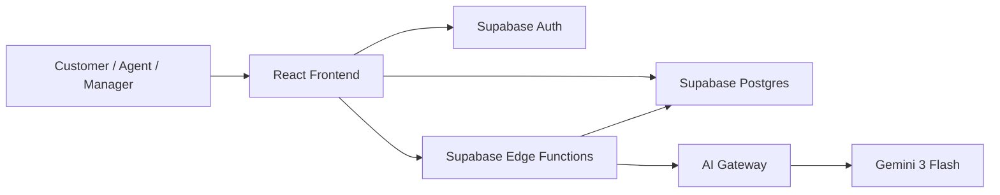
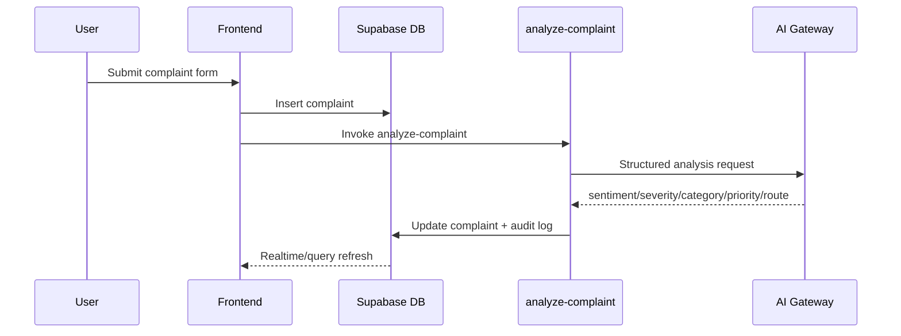
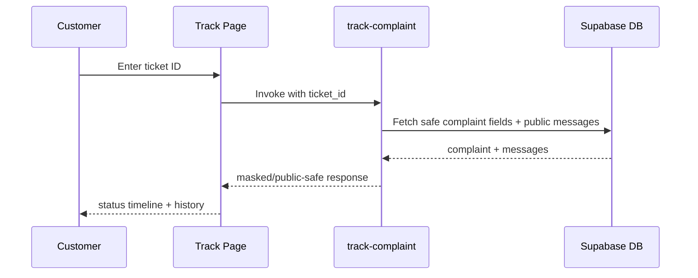

# 🚀 CustomerPulse AI

<p align="center">
  <b>AI-powered complaint intelligence platform for BFSI service operations</b><br/>
  Intake • Triage • SLA Risk • Resolution • Reporting • Public Tracking
</p>

<p align="center">
  
  
  
  
  
</p>

---

## ✨ Why this project exists

Traditional complaint workflows are often fragmented, manual, and reactive.

CustomerPulse AI transforms that into an **intelligent, auditable, and role-based operating system** for complaint resolution:

- ⚡ faster triage using AI analysis
- 🎯 better prioritization and routing
- ⏱ predictive SLA breach prevention
- 📊 manager-grade analytics and reports
- 🔎 transparent customer-facing complaint tracking

---

## 🧩 At a glance

| Layer | What it does | Tech |
|---|---|---|
| **Frontend** | Role-based complaint operations UI | React, TypeScript, Vite, shadcn-ui, Tailwind |
| **Data + Auth** | Secure data model + login/session/roles | Supabase Postgres + Supabase Auth + RLS |
| **Automation** | Complaint analysis, routing, insights, chat, tracking | Supabase Edge Functions |
| **AI/NLP** | Sentiment, severity, duplicate detection, response generation, insights, assistant | OpenRouter-compatible gateway + Gemini 3 Flash |

---

## 🗺 Navigation

- [Product Vision](#-product-vision)
- [Architecture](#-architecture)
- [Complete Page Guide](#-complete-page-guide)
- [Auth and Role Model](#-auth-and-role-model)
- [Hooks and Frontend Function Map](#-hooks-and-frontend-function-map)
- [AI/NLP Capabilities](#-ainlp-capabilities)
- [Backend Edge Functions](#-backend-edge-functions)
- [Database, RLS, Triggers](#-database-rls-triggers)
- [End-to-End Flows](#-end-to-end-flows)
- [Run Locally](#-run-locally)
- [Environment Variables](#-environment-variables)
- [Known Gaps and Improvements](#-known-gaps-and-improvements)

---

## 🎯 Product Vision

CustomerPulse AI is designed for BFSI-style complaint handling teams where speed, compliance, and transparency matter.

It covers the full lifecycle:
1. Complaint intake
2. AI-assisted analysis and optional auto-routing
3. Agent collaboration and communication
4. SLA monitoring and notifications
5. Analytics and compliance reporting
6. Public complaint tracking

---

## 🏗 Architecture



### Frontend
- React + TypeScript + Vite
- React Router route-level navigation
- TanStack React Query state for queries/mutations
- shadcn-ui + Tailwind for consistent, responsive UI

### Backend
- Supabase Postgres for core data
- Supabase Auth for authentication/session
- Supabase RLS + role helpers for scoped data access
- Edge functions for AI and operational automation

### AI Layer
- Gateway URL: `AI_GATEWAY_URL` (defaults to OpenRouter chat completions endpoint)
- Model: `google/gemini-3-flash-preview`
- Mix of structured tool-calling + streaming responses

---

## 📄 Complete Page Guide

### Route summary

| Route | Page | Access | Primary purpose |
|---|---|---|---|
| `/login` | `LoginPage` | Public | Sign in / sign up with role selection |
| `/track` | `TrackComplaintPage` | Public | Public complaint tracking by ticket ID |
| `/` | `DashboardPage` | Protected | Main operations dashboard |
| `/complaint/:id` | `ComplaintDetailPage` | Protected | Full complaint workspace |
| `/new-complaint` | `NewComplaintPage` | Protected | Complaint registration form |
| `/analytics` | `AnalyticsPage` | Admin/Manager/Supervisor | KPI + AI insights + charts + assistant |
| `/reports` | `ReportsPage` | Admin/Manager/Supervisor | RBI-style and SLA reports with export |
| `/performance` | `AgentPerformancePage` | Admin/Manager/Supervisor | Agent scorecards and comparisons |
| `/admin` | `AdminPage` | Admin/Manager | Approvals, agents, SLA rules, settings |
| `*` | `NotFound` | Public | 404 fallback |

---

<details>
<summary><b>🔐 /login → LoginPage (click to expand)</b></summary>

**Purpose**
- Internal user authentication.

**UI behavior**
- Toggle between Sign In and Sign Up.
- Sign Up supports role selection: `agent` or `manager`.
- Manager signup shows “requires approval” notice.

**Key function**
- `handleSubmit(e)`
  - Sign In: `signIn(email, password)` then navigate `/`.
  - Sign Up: `signUp(email, password, fullName, selectedRole)`.

**Dependencies**
- `useAuth()` and `sonner` toasts.

</details>

<details>
<summary><b>🔎 /track → TrackComplaintPage (click to expand)</b></summary>

**Purpose**
- Public complaint tracking portal.

**UI behavior**
- Accepts ticket format `CMP-YYYY-NNNNNN`.
- Renders status card, progression steps, and public messages.

**Key function**
- `handleTrack(e)`
  - invokes `track-complaint` edge function with `{ ticket_id }`.
  - maps and displays complaint/messages.

**Derived state**
- `currentStepIndex` for stage progression.
- `statusInfo` from status map.

</details>

<details>
<summary><b>📊 / → DashboardPage (click to expand)</b></summary>

**Purpose**
- Daily complaint operations center.

**Main UI blocks**
- KPI cards
- filter + sort toolbar
- mobile cards and desktop table
- `PredictiveSLAWidget`

**Key functions**
- `priorityOrder(p)` helper
- `handleSort(key)`
- `clearFilters()`

**Core logic**
- role-scoped complaint visibility:
  - supervisors: all complaints
  - others: assigned/self-created/profile-name/unassigned

</details>

<details>
<summary><b>🧠 /complaint/:id → ComplaintDetailPage (click to expand)</b></summary>

**Purpose**
- Full single-complaint workspace.

**Main UI blocks**
- complaint header + status controls + escalation
- AI analysis card
- AI response generation
- conversation thread + composer
- customer card + SLA card
- duplicate detector
- audit trail

**Key interactions**
- status update via `updateComplaint.mutate({ id, status })`
- one-click escalate to `critical` + `in_progress`

**Data hooks**
- `useComplaint(id)`
- `useComplaintMessages(id)`
- `useAuditLog(id)`
- `useUpdateComplaint()`

</details>

<details>
<summary><b>📝 /new-complaint → NewComplaintPage (click to expand)</b></summary>

**Purpose**
- Validated complaint intake form.

**Validation**
- Zod schema `complaintSchema` + React Hook Form.

**Key function**
- `onSubmit(data)`
  - create complaint
  - success toast
  - navigate dashboard

**Backend effect**
- async AI analysis trigger (`analyze-complaint`) from create hook.

</details>

<details>
<summary><b>📈 /analytics → AnalyticsPage (click to expand)</b></summary>

**Access**
- `admin`, `manager`, `supervisor`

**Purpose**
- Management analytics + AI interpretation layer.

**Tabs**
- `AI Insights` (`AIInsightsPanel`)
- `AI Assistant` (`AIAgentChat`)
- `Charts`

**Key memo**
- `stats` computes volume, distribution, SLA and agent snapshots.

</details>

<details>
<summary><b>📑 /reports → ReportsPage (click to expand)</b></summary>

**Access**
- `admin`, `manager`, `supervisor`

**Purpose**
- Compliance and operational reporting.

**Tabs**
- RBI Annexure report
- SLA Breach report

**Key functions**
- `exportCSV(data, filename)`
- `exportPDF(data, title)` using `jspdf` + `jspdf-autotable`
- `downloadFile(content, filename, type)`
- `getMostCommon(arr)`

</details>

<details>
<summary><b>🏆 /performance → AgentPerformancePage (click to expand)</b></summary>

**Access**
- `admin`, `manager`, `supervisor`

**Purpose**
- Agent quality and productivity scoring.

**Key metrics**
- handled/resolved/open
- avg resolution hours
- SLA compliance
- first response rate
- overall weighted score

**Score formula**
- 30% resolution + 30% SLA + 20% speed + 20% first response.

</details>

<details>
<summary><b>🛠 /admin → AdminPage (click to expand)</b></summary>

**Access**
- `admin`, `manager`

**Purpose**
- Operational control plane.

**Tabs**
- `ApprovalsTab`: approve pending users
- `AgentsTab`: add/edit/toggle agents
- `SLARulesTab`: create/update/toggle SLA rules
- `CategoriesTab`: static category list
- `SettingsTab`: organization + account display

**Notable helpers**
- `openEdit(...)`, `resetForm(...)` patterns in tab forms

</details>

---

## 🔐 Auth and Role Model

### `AuthProvider` responsibilities
- session and user state management
- profile and role fetch
- role-check helpers:
  - `hasRole(role)`
  - `hasAnyRole(...roles)`
- auth actions:
  - `signIn(email, password)`
  - `signUp(email, password, fullName, role)`
  - `signOut()`

### `ProtectedRoute` behavior
- redirect unauthenticated users to `/login`
- block non-approved users with pending-approval screen
- enforce route-level role requirements

### Role hierarchy
- `admin` > `manager` > `supervisor` > `agent`

---

## 🪝 Hooks and Frontend Function Map

| Hook | Core responsibility | Key functions |
|---|---|---|
| `useComplaints` | complaint data + realtime list sync | `useComplaints`, `useComplaint`, `useComplaintMessages`, `useAuditLog` |
| `useComplaints` (mutations) | complaint writes and side effects | `useCreateComplaint`, `useUpdateComplaint`, `useTriggerSlaCheck` |
| `useComplaints` (support data) | related lookup data | `useAgents`, `useSlaRules` |
| `useAIFeatures` | AI-driven actions | `useGenerateResponse`, `useDetectDuplicates`, `usePredictSlaBreach`, `useAIInsights`, `useAIChat` |
| `useNotifications` | notification feed + unread state | realtime audit log subscription + `markAllRead()` |
| `useAuth` | auth state and role model | sign-in/up/out and role checks |

---

## 🤖 AI/NLP Capabilities

| Capability | Frontend entry | Edge function | Output |
|---|---|---|---|
| Complaint triage | New complaint flow | `analyze-complaint` | sentiment, severity, key issues, draft, optional category/priority/routing updates |
| Duplicate detection | Complaint detail | `detect-duplicates` | match list with similarity and reason |
| Response generation | Complaint detail | `generate-response` | tone-controlled customer reply + subject + key actions |
| Predictive SLA risk | Dashboard widget | `predict-sla` | breach probability, risk factors, recommended action |
| Trend insights | Analytics tab | `ai-insights` | executive summary, trends, root causes, recommendations |
| AI assistant chat | Analytics tab | `ai-chat` | streaming operational assistant responses |

### NLP dimensions applied
- sentiment class + confidence score
- severity score
- issue extraction
- duplicate/pattern similarity
- tone-conditioned generation
- risk-level prediction

---

## ⚙ Backend Edge Functions

| Function | Trigger / usage | Key logic | Side effects |
|---|---|---|---|
| `analyze-complaint` | after complaint creation | AI analysis + optional auto category/priority/routing | updates complaints + inserts audit events |
| `detect-duplicates` | manual from detail page | compare against recent complaints | read-only |
| `generate-response` | manual from detail page | tone-based response drafting | read-only |
| `predict-sla` | manual widget action | open-ticket risk prediction | read-only |
| `ai-insights` | analytics tab action | full-dataset trend and risk analysis | read-only |
| `ai-chat` | assistant conversation | streaming contextual responses | read-only |
| `sla-monitor` | periodic/scheduled | recompute hours remaining and status | updates complaints + logs warnings/breaches |
| `sla-notifications` | assignment/SLA events | central notification + audit logging | writes audit + optional SLA status patch |
| `track-complaint` | public tracking page | validated ticket lookup + safe public response | read-only public payload |

---

## 🗄 Database, RLS, Triggers

### Core enums
- `app_role`
- `complaint_status`
- `complaint_priority`
- `complaint_channel`
- `complaint_category`
- `sentiment_type`
- `sla_status_type`

### Core tables
- `profiles`
- `user_roles`
- `customers`
- `agents`
- `complaints`
- `messages`
- `audit_log`
- `sla_rules`

### Security helper functions
- `has_role(_user_id, _role)`
- `is_assigned_to_complaint(_user_id, _complaint_id)`
- `has_supervisor_access(_user_id)`
- `get_agent_id(_user_id)`

### Triggers and automation
- `on_auth_user_created` → default profile + role creation
- `update_updated_at_column` triggers on operational tables
- `generate_complaint_ticket_id` via `generate_ticket_id`

### RLS model
- role-scoped access for complaint operations
- expanded visibility for supervisors/managers/admins
- scoped write access for operational integrity

---

## 🔄 End-to-End Flows

### 1) Complaint intake to AI triage



### 2) Public tracking flow



---

## 🧪 Run locally

### Requirements
- Node.js 18+
- npm

### Setup

```sh
npm install
npm run dev
```

### Scripts
- `npm run dev` → start development server
- `npm run build` → production build
- `npm run preview` → preview production build
- `npm run lint` → lint checks
- `npm run test` → vitest tests

---

## 🔑 Environment Variables

### Frontend
- `VITE_SUPABASE_URL`
- `VITE_SUPABASE_PUBLISHABLE_KEY`

### Edge functions / backend secrets
- `AI_GATEWAY_API_KEY`
- `AI_GATEWAY_URL` (optional)
- `SUPABASE_URL`
- `SUPABASE_SERVICE_ROLE_KEY`

---

## 📌 Known Gaps and Improvements

1. `AdminPage` SLA “Any” handling uses string `any`; this can conflict with enum-backed DB fields.
2. `track-complaint` contains one extra unused message-fetch request before UUID-based fetch.
3. `AnalyticsPage` includes one illustrative fallback metric value (`avgResolution = 18.5`).
4. `SettingsTab` save action is currently demo-style (toast only).
5. AI workflows currently have no non-AI fallback if API credits/rate-limit fail.

---

## 🏁 Selected Theme

**AI for Customer Experience, Service Operations, and Complaint Resolution (BFSI-focused)**
